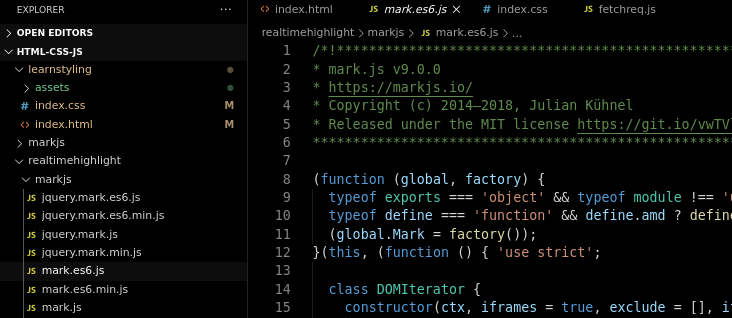
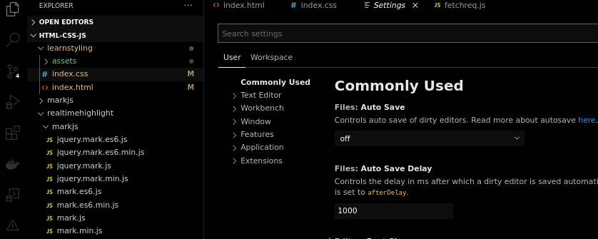
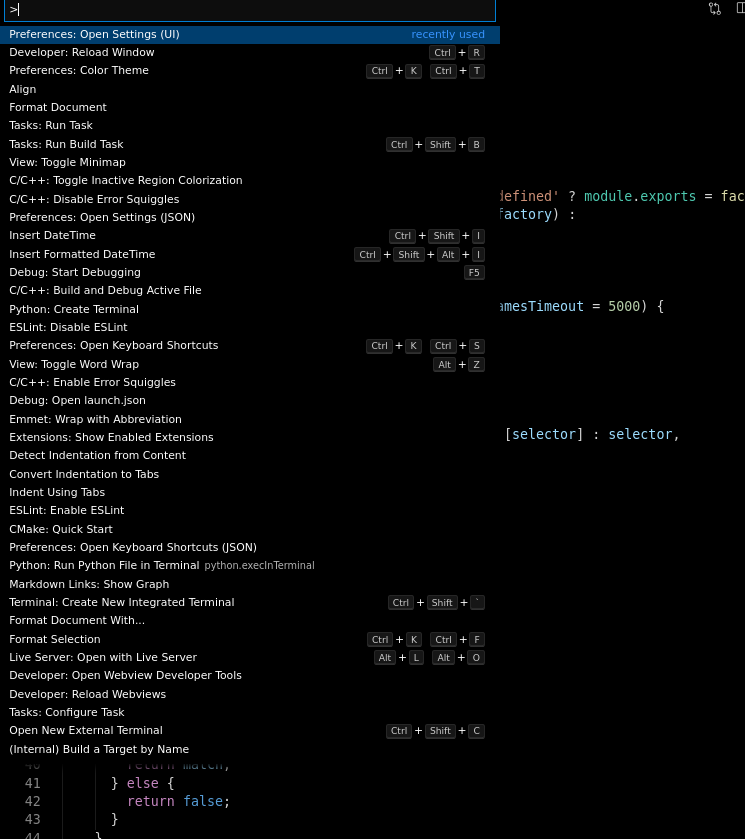

# VS Code Vanta Black Color Theme 
## Inspired by [Pitch Black Theme](https://github.com/ViktorQvarfordt/vscode-pitch-black-theme)

> In the beginning God created the heaven and the earth.
> And the earth was without form, and void; and darkness was upon the face of the deep. 
> And the Spirit of God moved upon the face of the waters.
> And God said, ~~Let there be light: and there was light.~~ I like dark theme

## Install

Download the `vsix` package from this repo's releases and install it from vscode's command pallete

## Screenshot

### Editor window

---

### Settings

---

### Command Pallete

---

> This theme is extended from Pitch black theme
